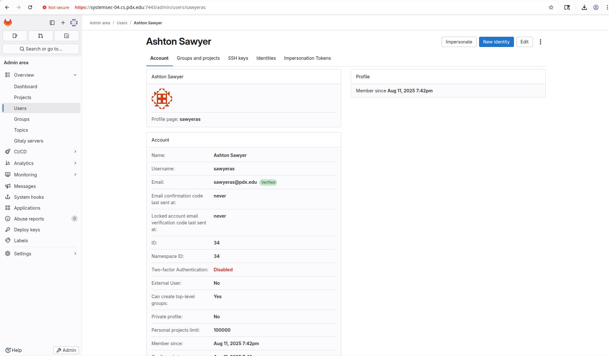
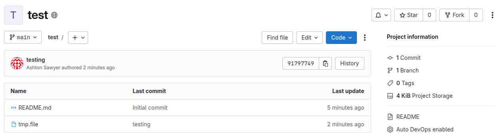

# Services

## gitlab
kevin says:
    don't need MTA -- set things that need it to no ops
    change gitlab port only if port conflict

NOTES:
spin up docker container 
login with root:<passwd in config/initial_root_password>
create user sawyeras

change password as admin to avoid email req
able to sign in as created user
able to create repo, clone, and push
```
$ git clone ssh://git@systemsec-04.cs.pdx.edu:7022/sawyeras/test.git
Cloning into 'test'...
remote: Enumerating objects: 3, done.
remote: Counting objects: 100% (3/3), done.
remote: Compressing objects: 100% (2/2), done.
remote: Total 3 (delta 0), reused 0 (delta 0), pack-reused 0 (from 0)
Receiving objects: 100% (3/3), done.

 $ cd test
 $ vim tmp.file
 $ git add .
 $ git commit -m "testing"
[main 9179774] testing
 1 file changed, 1 insertion(+)
 create mode 100644 tmp.file

 $ git push origin main
Enumerating objects: 4, done.
Counting objects: 100% (4/4), done.
Delta compression using up to 24 threads
Compressing objects: 100% (2/2), done.
Writing objects: 100% (3/3), 301 bytes | 150.00 KiB/s, done.
Total 3 (delta 0), reused 0 (delta 0), pack-reused 0
To ssh://systemsec-04.cs.pdx.edu:7022/sawyeras/test.git
   1a48635..9179774  main -> main
```


changed root password because default gets removed after 24hrs? 

changed config to make internal ports match internal and change http to
https. add tz to make cookie check work. then CLEAR COOKIES or it won't
realize it's been fixed...

## bitwarden
vaultwarden is easier says kevin

domain -- need a domain name for ssl cert, usually handled w/ dynamic dns
	point at cs.pdx.edu/pdx.edu

Ended up just doing minimal config and then ssh port forwarding
ssh -NL 80:noble0:80 bsd


## Frigate
docker compose from logan

spin it up
get creds from logs
login
nothing to see bc no cameras

## Jekyll
set up a runner according to docs

grabbed gitlab example repo for jekyll

added gitlab runner to passwdless sudo
made custom clone url to http://localhost:7080 for runner


# Terraform + Ansible
