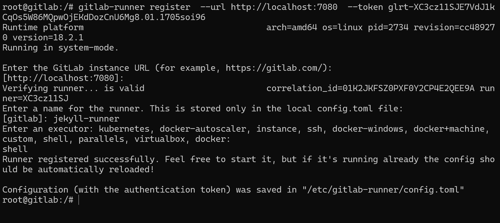
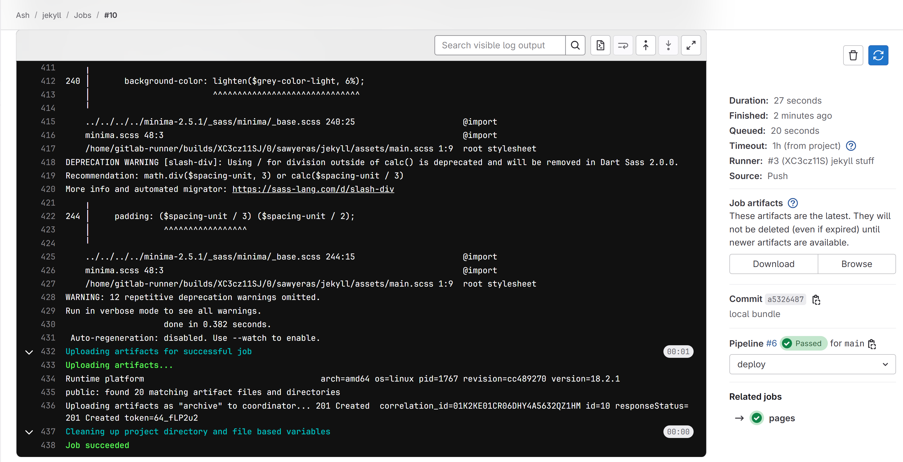
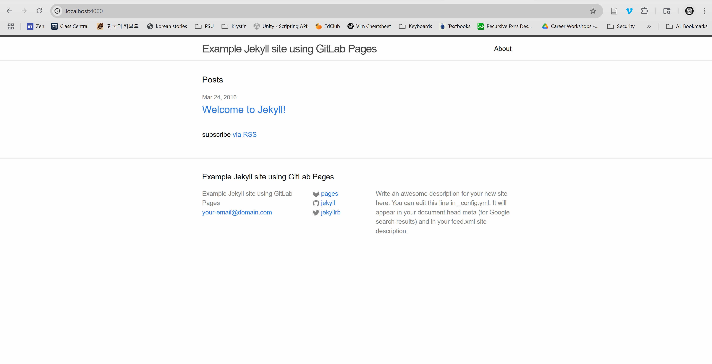

# Services

## gitlab
I grabbed the docker compose file from Gitlab's officiall documentation. I 
changed the ports to ones that made sense to me. It's important to note that 
the external HTTP port has to match the internal one or it won't work with 
CI/CD. I'm not positive why, but I think it has to do with how the links are
generated. 

It takes a while to spin up, but once it does you can log in with the creds
root:<password in config/initial_root_password>. I changed the admin password
right away because the `initial_root_password` file says that the password is
invalid after 24 hours. 

I also had to add a TZ environment variable in order to login successfully.
Without it, it would accept the credentials but then throw error 422. If you 
add the variable and it's still not working, try clearing cookies...

Then I created a user. Normally it's supposed to send the new user and email
asking them to set their password, but I didn't want to set up SMTP. Instead, 
as soon as the user is created, you can change their password as the admin and
they can sign in with that. When they sign it, it will ask them to change their
password, and then it works as expected. 


Once I had a user, I was able to create a repository, clone it, and push to it
as normal. (You can also have a repo as admin, but...)

```
$ git clone ssh://git@systemsec-04.cs.pdx.edu:7022/sawyeras/test.git
Cloning into 'test'...
remote: Enumerating objects: 3, done.
remote: Counting objects: 100% (3/3), done.
remote: Compressing objects: 100% (2/2), done.
remote: Total 3 (delta 0), reused 0 (delta 0), pack-reused 0 (from 0)
Receiving objects: 100% (3/3), done.

 $ cd test
 $ vim tmp.file
 $ git add .
 $ git commit -m "testing"
[main 9179774] testing
 1 file changed, 1 insertion(+)
 create mode 100644 tmp.file

 $ git push origin main
Enumerating objects: 4, done.
Counting objects: 100% (4/4), done.
Delta compression using up to 24 threads
Compressing objects: 100% (2/2), done.
Writing objects: 100% (3/3), 301 bytes | 150.00 KiB/s, done.
Total 3 (delta 0), reused 0 (delta 0), pack-reused 0
To ssh://systemsec-04.cs.pdx.edu:7022/sawyeras/test.git
   1a48635..9179774  main -> main
```


### Docker
```
services:
  gitlab:
    image: gitlab/gitlab-ce:18.0.6-ce.0
    container_name: gitlab
    restart: always
    hostname: 'gitlab'
    environment:
      TZ: 'America/Los_Angeles'
      GITLAB_OMNIBUS_CONFIG: |
        external_url 'http://systemsec-04.cs.pdx.edu:7080'
    ports:
      - '7080:7080'
      - '7022:22'
      - '4000:4000' # jekyll
    volumes:
      - './config:/etc/gitlab'
      - './logs:/var/log/gitlab'
      - './data:/var/opt/gitlab'
    shm_size: '256m'
```

## bitwarden
I used the vaultwarden image rather than bitwarden since that was supposed
to be easier to set up. 

I tried to set up vaultwarden with HTTPS using DuckDNS created certificates. 
That did not work. Instead, I was able to access vaultwarden with ssh port
forwards and then accessing it on `http://localhost`. 

```
 $ ssh -NL 80:192.168.33.66:80 bsd
```


### Docker
```
services:
  vaultwarden:
    image: vaultwarden/server:latest
    container_name: vaultwarden
    restart: always
    environment:
      # DOMAIN: "https://vaultwarden.example.com/"  # required when using a reverse proxy;
      SIGNUPS_ALLOWED: "true" # Deactivate this with "false" after you have created account
    volumes:
      - ./vw-data:/data # the path before the : can be changed
    ports:
      - 80:80
```

## Frigate
I got the docker compose file from a guide that Logan showed me. Once I spun it
up, I was able to get the credentials from the logs and login. I stopped there 
because I don't actually have a camera to hook it up to. 


### Docker
```
services:
  frigate:
    container_name: frigate
    restart: unless-stopped
    stop_grace_period: 30s
    image: ghcr.io/blakeblackshear/frigate:stable
    volumes:
      - ./config:/config
      - ./storage:/media/frigate
      - type: tmpfs # Optional: 1GB of memory, reduces SSD/SD Card wear
        target: /tmp/cache
        tmpfs:
          size: 1000000000
    ports:
      - "8971:8971"
      - "8554:8554" # RTSP feeds
```

## Jekyll
I made a jekyll repository for running the pipeline in. Then I started by 
creating a runner. I set it to run on untagged jobs.

I installed the runner within the gitlab docker container by running commands
supplied by the setup page. 



I grabbed the `.gitlab-ci.yml` and required Jekyll files from one of the gitlab
example repos. 

In order to make the job actually complete, I needed to do a little bit more 
setup.

Within the docker container:
- `apt upgrade`
- Install sudo (+ vim for QOL)
- Create a symbolic link to git in `/usr/local/bin/`
- Install ruby-full and build-essential
- Add gitlab-runner user to password-less sudo

In GitLab admin console:
- Change http clone url to http://localhost:7080

In .gitlab-ci.yml:
- Change gem install to sudo gem install
- Have bundle install to a local directory (vendor/bundle)

At this point, the job was able to sucessfully complete and I could download
the artifact (the output of Jekyll). 



I also had the pipeline run `jekyll serve` so that I 
could see the generated site on localhost. In order for it to work, I had to
add `--host 0.0.0.0` so that I could see it from outside of the container. 
I also had to add a `4000:4000` port thing to the docker compose file.

I set up an SSH port forward and then was able to see the generated page from
my local machine. 



It's a little funky, because the CI/CD job doesn't detect that the job has 
finished, but it works as a proof of concept. 

### Pipeline
```
image: ruby:latest

variables:
  JEKYLL_ENV: production
  LC_ALL: C.UTF-8

before_script:
  - sudo gem install bundler
  - bundle config set path 'vendor/bundle'
  - bundle install

test:
  stage: test
  script:
  - bundle exec jekyll build -d test
  artifacts:
    paths:
    - test
  rules:
    - if: $CI_COMMIT_REF_NAME != $CI_DEFAULT_BRANCH

pages:
  stage: deploy
  script:
  - bundle exec jekyll build -d public
  - bundle exec jekyll serve --host 0.0.0.0
  artifacts:
    paths:
    - public
  rules:
    - if: $CI_COMMIT_REF_NAME == $CI_DEFAULT_BRANCH

```

# Terraform + Ansible
kept having a problem with noble0 running out of memory while I was working 
on the gitlab + jekyll stuff. changed it so noble0 has 6-8G and bsd has 2-2.5G
