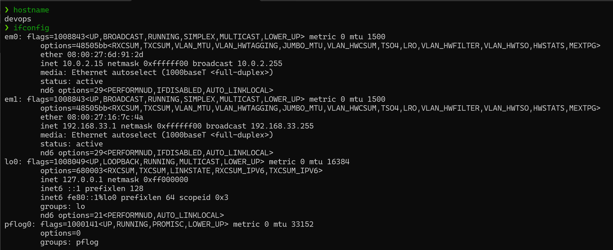

# VM Setup
I set up the FreeBSD VM according to the instructions and script given in
class, so I didn't have to pay much attention to the way the firewall rules
were set up.

The same is mostly true about the Ubuntu VM setup. I did expand the drive.

```
❯ sudo lvscan
  ACTIVE            '/dev/ubuntu-vg/ubuntu-lv' [<11.50 GiB] inherit
❯ sudo lvextend --extents +100%FREE /dev/ubuntu-vg/ubuntu-lv --resizefs
  Size of logical volume ubuntu-vg/ubuntu-lv changed from <11.50 GiB (2943 extents) to <23.00 GiB (5887 extents).
  Logical volume ubuntu-vg/ubuntu-lv successfully resized.
resize2fs 1.47.0 (5-Feb-2023)
Filesystem at /dev/mapper/ubuntu--vg-ubuntu--lv is mounted on /; on-line resizing required
old_desc_blocks = 2, new_desc_blocks = 3
The filesystem on /dev/mapper/ubuntu--vg-ubuntu--lv is now 6028288 (4k) blocks long.
```

Most of the packages HW1 told us to install were already installed by the 
startup script.

# Networking

## FreeBSD


## Ubuntu 


## .ssh/config
```
Host bsd
	Hostname localhost
	Port 2222
	User sawyeras

Host noble
	Hostname 192.168.33.69
	ProxyJump bsd
	User sawyeras
```
