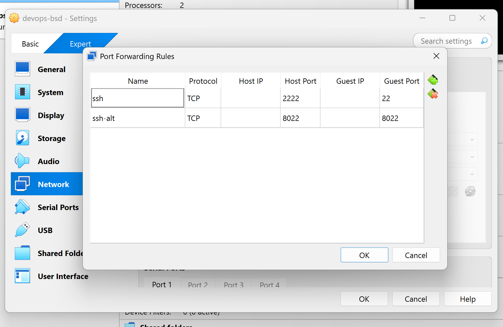

# SSH 
The goal is for it to look like the FreeBSD host is running all provided 
services. A part of doing this is to redirect traffic from bsd to the 
host that is actually providing that service. 

## Setting up ssh-alt
Part of redirecting ssh traffic from bsd to noble means that if I want to keep
ssh-ing to bsd I need another port that doesn't get redirected. 

The first set in doing so was to create another port forward from my local 
machine to the VirtualBox VM. 



Then, I adjusted the firewall rule to allow traffic on port 8022. 

```conf
pass in on $ext_if proto tcp to port { ssh, 8022 } keep state (max-src-conn 15, max-src-conn-rate 3/1, overload <bruteforce> flush global)
```

And instantiated it

```zsh
 > pfctl -vf /etc/pf.conf
```

Finally, I changed `/etc/ssh/sshd_config` so that the ssh service would run on
port 8022 instead of 22

```
...
# Note that some of FreeBSD's defaults differ from OpenBSD's, and
# FreeBSD has a few additional options.

Port 8022
#AddressFamily any
#ListenAddress 0.0.0.0
#ListenAddress ::
...
```

## Redirecting SSH Traffic
There are two rules that need to be added to `pf.conf` to redirect the ssh
traffic

```conf
# redirect traffic from bsd to noble
rdr pass log on $ext_if inet proto tcp from any to port ssh -> $server port ssh

# allow redirected traffic to pass through firewall
pass out on $int_if proto tcp from any to $server port { ssh } keep state
```
At this point I should have been able to ssh into noble through bsd without a 
ProxyJump, but it wasn't working. `tcpdump` showed that the ssh packets were 
reaching em0 and being logged by the redirect rule, but weren't reaching
em1 or noble. 

The problem ended up being that `$server` had the wrong IP address. It said 
192.168.33.63 instead of 192.163.33.69. Once that was changed, it worked as
expected. 

The last thing was to update the `.ssh/config` on my local machine. 

```
Host bsd
	Hostname localhost
	Port 8022
	User sawyeras

Host noble
	Hostname localhost
	Port 2222
	User sawyeras
```

# Suricata

## Install 
```
 > sudo pkg install suricata

...

Message from suricata-7.0.10:

--
If you want to run Suricata in IDS mode, add to /etc/rc.conf:

        suricata_enable="YES"
        suricata_interface="<if>"

NOTE: Declaring suricata_interface is MANDATORY for Suricata in IDS Mode.

...

Alternatively, if you want to run Suricata in Inline IPS Mode in high-speed
netmap(4) mode, add to /etc/rc.conf:

        suricata_enable="YES"
        suricata_netmap="YES"

NOTE:
        Suricata requires additional interface settings in the configuration
        file to run in netmap(4) mode.

...
```

## Config
First I made sure Suricata was enabled on start up. 

```
 > sudo vim /etc/rc.conf

 > cat /etc/rc.conf

...
suricata_enable="YES"
suricata_netmap="YES"

```

We know that this configuration works because after a reboot we can see that 
Suricata is running, and it's running in netmap mode as intended.

```
 > ps aux | grep suricata
root      880   4.9 28.1 1907460 1162824  -  Ss   14:41   0:35.26 /usr/local/bin/suricata -D --netmap --pidfile /var/run/suricata.pid -c /usr/local/etc/suricata/suricata.yaml
```

The next big thing was to actually get some rules. Suricata by default doesn't
come with any rules installed. That doesn't mean you have to add them all 
yourself, though. 

```
 > sudo suricata-update

...

9/7/2025 -- 11:54:55 - <Info> -- Writing rules to /var/lib/suricata/rules/suricata.rules: total: 59757; enabled: 44163; added: 59757; removed 0; modified: 0
9/7/2025 -- 11:54:56 - <Info> -- Writing /var/lib/suricata/rules/classification.config
9/7/2025 -- 11:54:57 - <Info> -- Testing with suricata -T.
9/7/2025 -- 11:55:15 - <Info> -- Done.
```

This installs a whole host of rules, most of which are activated by default. 
Some are installed, but left commented out in the `suricata.rules` file. 
I didn't bother activating any of the rules that were left off by default. 
Skimming through the rules file, most of them seemed fairly niche and like
I wasn't missing much without them. 


After I installed the rules, I did a little bit more configuring in 
`suricata.yaml`. Honestly, this configuration needs to happen before you can
properly run in netmap mode, as the interface is pulled out of the config.
But editing `rc.conf` is way less work, so I did do that first. Suricata
just wasn't running properly until I got this done. 

Also... I did add 8022 to the SSH port group. I don't actually know what that
does, but it seemed like a reasonable thing to do. 

```
 > sudo vim /usr/local/etc/suricata/suricata.yaml

 > cat /usr/local/etc/suricata/suricata.yaml
vars:
  # more specific is better for alert accuracy and performance
  address-groups:
    HOME_NET: "[192.168.33.0/24]"

  ...

  port-groups:
    SSH_PORTS: "[22,8022]"
    DNP3_PORTS: 20000
    MODBUS_PORTS: 502
    FILE_DATA_PORTS: "[$HTTP_PORTS,110,143]"

...

netmap:
  - interface: em0
    copy-mode: ips
    copy-iface: em0^
  - interface: em0^
    copy-mode: ips
    copy-iface: em0
```
    
At this point we can look at `suricata.log` and see that it's running and has
rules loaded. 

```
 > sudo tail -n 11 /var/log/suricata/suricata.log
[100151 - Suricata-Main] 2025-07-14 12:53:03 Info: detect: 1 rule files processed. 44167 rules successfully loaded, 0 rules failed, 0
[100151 - Suricata-Main] 2025-07-14 12:53:03 Info: threshold-config: Threshold config parsed: 0 rule(s) found
[100151 - Suricata-Main] 2025-07-14 12:53:03 Info: detect: 44170 signatures processed. 948 are IP-only rules, 4368 are inspecting packet payload, 38632 inspect application layer, 109 are decoder event only
[100151 - Suricata-Main] 2025-07-14 19:53:17 Info: runmodes: em0: creating 1 thread
[100161 - W#01-em0] 2025-07-14 19:53:21 Info: netmap: netmap:em0/R: em0 opened [fd: 7]
[100161 - W#01-em0] 2025-07-14 19:53:22 Info: netmap: netmap:em0^/T: em0^ opened [fd: 8]
[100151 - Suricata-Main] 2025-07-14 19:53:22 Info: runmodes: em0^: creating 1 thread
[100171 - W#01-em0^] 2025-07-14 19:53:23 Info: netmap: netmap:em0^/R: em0^ opened [fd: 9]
[100171 - W#01-em0^] 2025-07-14 19:53:25 Info: netmap: netmap:em0/T: em0 opened [fd: 10]
[100151 - Suricata-Main] 2025-07-14 19:53:25 Info: unix-manager: unix socket '/var/run/suricata/suricata-command.socket'
[100151 - Suricata-Main] 2025-07-14 19:53:25 Notice: threads: Threads created -> W: 2 FM: 1 FR: 1   Engine started.
```

Now we need to check if it's actually going to alert on things
(we're running in IPS mode, so it could drop packets, but I didn't see any 
default rules that actually dropped traffic). The best thing to do probably
would have been finding a real payload that would trigger a rule. The lazy 
thing to do is to add a rule that should trigger on literally everything and
see if it does. I chose the lazy option. 

```
 > sudo vim /var/lib/suricata/rules/suricata.rules

 > head /var/lib/suricata/rules/suricata.rules
alert ip any any -> any any (msg:"DBG"; sid:11000000; rev:1;)
...

 > curl ifconfig.io
131.252.54.184

 > sudo cat /var/log/suricata/fast.log
...

07/14/2025-10:00:00.250423  [**] [1:11000000:1] DBG [**] [Classification: (null)] [Priority: 3] {UDP} 10.0.2.15:123 -> 141.11.228.173:123
07/14/2025-10:00:00.328993  [**] [1:11000000:1] DBG [**] [Classification: (null)] [Priority: 3] {UDP} 141.11.228.173:123 -> 10.0.2.15:123
07/14/2025-10:00:02.248333  [**] [1:11000000:1] DBG [**] [Classification: (null)] [Priority: 3] {UDP} 10.0.2.15:123 -> 143.42.229.154:123
07/14/2025-10:00:02.317334  [**] [1:11000000:1] DBG [**] [Classification: (null)] [Priority: 3] {UDP} 143.42.229.154:123 -> 10.0.2.15:123
07/14/2025-10:00:13.250081  [**] [1:11000000:1] DBG [**] [Classification: (null)] [Priority: 3] {UDP} 10.0.2.15:123 -> 144.202.66.214:123
07/14/2025-10:00:13.302504  [**] [1:11000000:1] DBG [**] [Classification: (null)] [Priority: 3] {UDP} 144.202.66.214:123 -> 10.0.2.15:123
07/14/2025-10:00:13.251883  [**] [1:11000000:1] DBG [**] [Classification: (null)] [Priority: 3] {UDP} 10.0.2.15:123 -> 69.30.247.121:123
07/14/2025-10:00:13.300207  [**] [1:11000000:1] DBG [**] [Classification: (null)] [Priority: 3] {UDP} 69.30.247.121:123 -> 10.0.2.15:123
07/14/2025-10:00:14.250867  [**] [1:11000000:1] DBG [**] [Classification: (null)] [Priority: 3] {UDP} 10.0.2.15:123 -> 66.228.58.20:123
07/14/2025-10:00:14.313010  [**] [1:11000000:1] DBG [**] [Classification: (null)] [Priority: 3] {UDP} 66.228.58.20:123 -> 10.0.2.15:123
07/14/2025-10:03:04.408615  [**] [1:11000000:1] DBG [**] [Classification: (null)] [Priority: 3] {UDP} 10.0.2.15:23341 -> 10.0.2.3:53
07/14/2025-10:03:04.432146  [**] [1:11000000:1] DBG [**] [Classification: (null)] [Priority: 3] {UDP} 10.0.2.3:53 -> 10.0.2.15:23341
07/14/2025-10:03:04.432841  [**] [1:11000000:1] DBG [**] [Classification: (null)] [Priority: 3] {UDP} 10.0.2.15:43897 -> 10.0.2.3:53
07/14/2025-10:03:04.436552  [**] [1:11000000:1] DBG [**] [Classification: (null)] [Priority: 3] {UDP} 10.0.2.3:53 -> 10.0.2.15:43897
07/14/2025-10:03:04.443052  [**] [1:11000000:1] DBG [**] [Classification: (null)] [Priority: 3] {TCP} 10.0.2.15:54724 -> 172.67.191.233:80
07/14/2025-10:03:04.450771  [**] [1:11000000:1] DBG [**] [Classification: (null)] [Priority: 3] {TCP} 172.67.191.233:80 -> 10.0.2.15:54724
```

## SMBGhost
One of the requirements is to make sure Suricata is protecting against SMBGhost
(CVE-2020-0796) attacks. I grabbed some rules off of the internet and generally
trust that probably they work okay maybe.

```
# from https://github.com/vncloudsco/suricata-rules/blob/main/emerging-exploit.rules
alert smb any any -> $HOME_NET any (msg:"ET EXPLOIT Possible Attempted SMB RCE Exploitation M1 (CVE-2020-0796)"; flow:established,to_server; content:"|41 8B 47 3C 4C 01 F8 8B 80 88 00 00 00 4C 01 F8 50|"; fast_pattern; reference:url,github.com/chompie1337/SMBGhost_RCE_PoC; reference:cve,2020-0796; classtype:attempted-admin; sid:2030263; rev:2; metadata:affected_product SMBv3, created_at 2020_06_08, deployment Perimeter, deployment Internal, former_category EXPLOIT, performance_impact Low, signature_severity Major, tag SMBGhost, updated_at 2020_06_08;)
alert smb any any -> $HOME_NET any (msg:"ET EXPLOIT Possible Attempted SMB RCE Exploitation M2 (CVE-2020-0796)"; flow:established,to_server; content:"|FF C9 8B 34 8B 4C 01 FE|"; fast_pattern; reference:url,github.com/chompie1337/SMBGhost_RCE_PoC; reference:cve,2020-0796; classtype:attempted-admin; sid:2030264; rev:2; metadata:affected_product SMBv3, created_at 2020_06_08, deployment Perimeter, deployment Internal, former_category EXPLOIT, performance_impact Low, signature_severity Major, tag SMBGhost, updated_at 2020_06_08;)
# from https://github.com/vncloudsco/suricata-rules/blob/main/pt-rules.rules
alert tcp any any -> any any (msg: "ATTACK [PTsecurity] CoronaBlue/SMBGhost DOS/RCE Attempt (CVE-2020-0796)"; flow: established; content: "|FC|SMB"; depth: 8; byte_test: 4, >, 0x800134, 8, relative, little; reference: url, www.mcafee.com/blogs/other-blogs/mcafee-labs/smbghost-analysis-of-cve-2020-0796; reference: cve, 2020-0796; reference: url, github.com/ptresearch/AttackDetection; classtype: attempted-admin; sid: 10005777; rev: 2;)
alert tcp any any -> any any (msg: "ATTACK [PTsecurity] CoronaBlue/SMBGhost DOS/RCE Attempt (CVE-2020-0796)"; flow: established; content: "|FC|SMB"; depth: 8; byte_test: 4, >, 0x800134, 0, relative, little; reference: url, www.mcafee.com/blogs/other-blogs/mcafee-labs/smbghost-analysis-of-cve-2020-0796; reference: cve, 2020-0796; reference: url, github.com/ptresearch/AttackDetection; classtype: attempted-admin; sid: 10005778; rev: 2;)
```

I haven't actually checked to make sure that these rules work. I haven't read
about SMBGhost to try and parse out if they work in theory. I'm not actually
running an SMB server and port 445 is fully blocked on the firewall. I tried 
multiple POC exploits and the sockets wouldn't connect (I'm assuming because 
of the firewall) and I couldn't find any packet captures that would do the 
trick. 

# hw2.sh
I'm *pretty* sure that this script works and could be run multiple times
without issue. I haven't fully tested it on a new install because that takes 
more time than I have right now. But I have tested the individual pieces that I
added on some dummy files. It's possible that I missed something from the 
original script that needs to be changed in order for re-running it to be safe,
but I don't think I did. 
