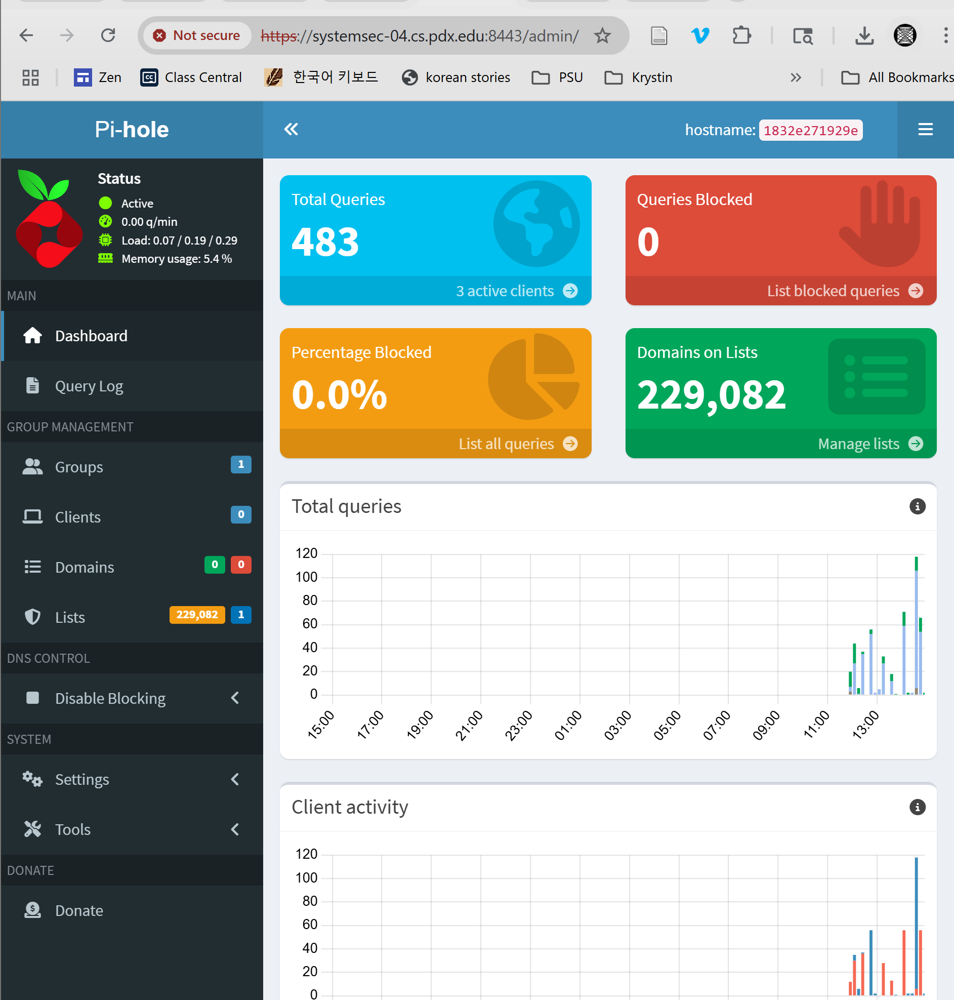
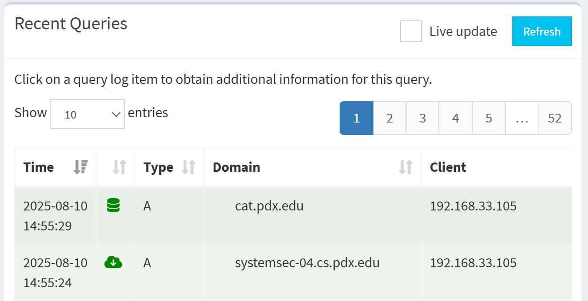
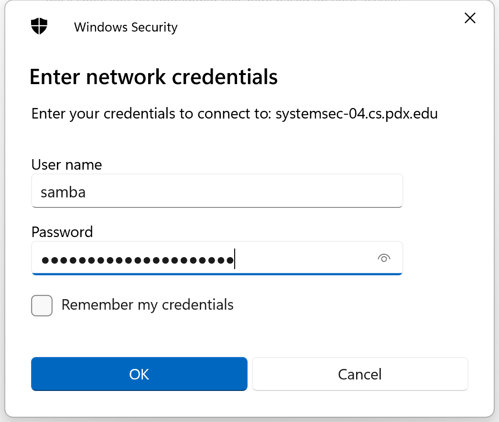
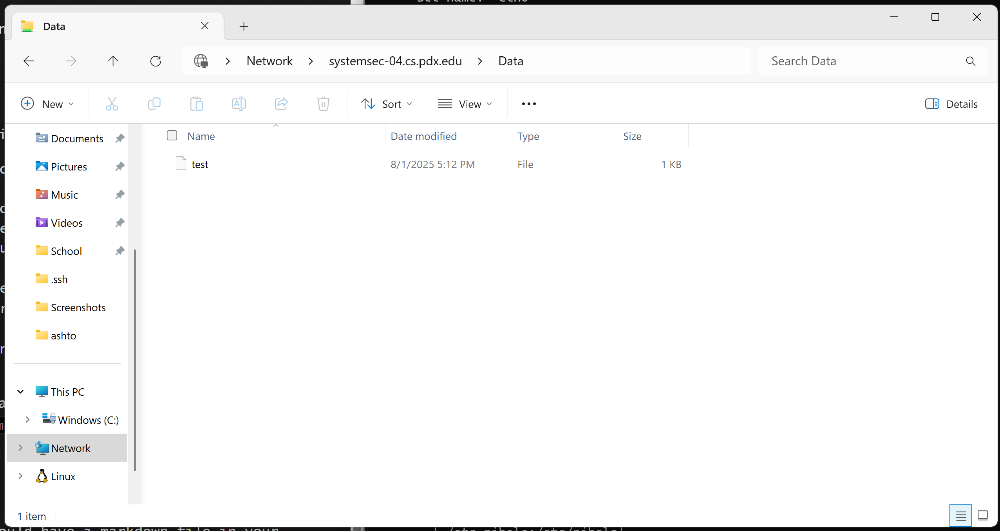

# Docker Compose
One of the first things that I did was add myself to the `docker` group so that
I wouldn't have to keep running `sudo`. 

```
 $ sudo usermod -aG docker $USER
```

Then log out and back in for the change to take effect. 

## Pi-Hole
I got started with the pihole. I got most of the settings from the [example 
docker file](https://github.com/pi-hole/docker-pi-hole?tab=readme-ov-file#quick-start). 

Initially when trying to start the container I got an error that the daemon 
failed to bind to port `0.0.0.0:53` because it was already in use. 

To get around this, I tried disabling the `resolved` service. 

```
 $ sudo systemctl stop systemd-resolved
```

This got rid of that error, but then nothing could resolve because the service
was disabled... In order to get DNS to resolve for the container, I added the
following block to the compose file:
```
dns:
  - 127.0.0.1
  - 1.1.1.1
```

This worked and I was able to use the container, but it felt a little cheat-y 
because I think it was just going through the pihole and straight to `1.1.1.1`.

Then I mostly scrapped what I was doing and followed [this 
guide](https://pimylifeup.com/pi-hole-docker/). 

### The Guide
I kept my original configuration file. 

Then I edited `/etc/systemd/resolved.conf` and added `DNSStubListener=no`. 

Then I removed `/etc/resolv.conf` and recreated it.

```
 $ sudo ln -s /run/systemd/resolve/resolv.conf /etc/resolv.conf
```

Then restarted the service

```
 $ sudo systemctl restart systemd-resolved
```

This is where the guide ended. 

To actually use the pihole as the default DNS server, I edited 
`/etc/netplan/50-cloud-init.yaml` to read as follows:
```
network:
  version: 2
  ethernets:
    eth0:
      match:
        macaddress: "bc:24:11:25:01:f5"
      dhcp4: true
      set-name: "eth0"
      nameservers:
        addresses: [192.168.33.67]
```

You can temporarily try the plan and then apply it with
```
 $ sudo netplan try
 $ sudo netplan apply
```

I checked what was being used as the server with `dig` and we can see that
`192.168.33.67` (the IP of the Ubuntu machine) is used as the server, and since
port 53 is passed through to the container, that means the pihole is being used.

```
 $ dig google.com

; <<>> DiG 9.18.30-0ubuntu0.24.04.2-Ubuntu <<>> google.com
;; global options: +cmd
;; Got answer:
;; ->>HEADER<<- opcode: QUERY, status: NOERROR, id: 14838
;; flags: qr rd ra; QUERY: 1, ANSWER: 1, AUTHORITY: 0, ADDITIONAL: 1

;; OPT PSEUDOSECTION:
; EDNS: version: 0, flags:; udp: 1232
; EDE: 3 (Stale Answer)
;; QUESTION SECTION:
;google.com.                    IN      A

;; ANSWER SECTION:
google.com.             0       IN      A       142.250.73.78

;; Query time: 1 msec
;; SERVER: 192.168.33.67#53(192.168.33.67) (UDP)
;; WHEN: Mon Aug 04 16:40:07 UTC 2025
;; MSG SIZE  rcvd: 61
```

We can also tell that the pihole is being used with the web dashboard that it
provides. 

Here we can see that the dashboard is accessible, and that it's been fielding 
queries. 



And if we query some sites with dig, we can see them show up in the "recent
queries" section

```
 $ dig systemsec-04.cs.pdx.edu
 $ dig cat.pdx.edu
```



## Samba
To set up the Samba server I found an image on docker hub. I chose the image
from dockurr because it seemed fairly legit. I used the docker config that's on
docker hub. 

In order to make it accessible, I needed to change the firewall rules on
the proxmox host and the FreeBSD bastion. 

```
Proxmox (/etc/nftables.conf):
	table ip nat {
	    chain prerouting {
		type nat hook prerouting priority -100; policy accept;
		...
		ip daddr 10.218.150.39 tcp dport 445 dnat to 172.20.0.102:445
	    }
	}

FreeBSD (/etc/pf.conf):
	rdr pass log on $ext_if inet proto tcp from any to port 445 -> $server port 445
	pass out on $int_if proto tcp from any to $server port 445
```

Then I put a test file in the director that's shared with the samba container
and tried accessing it from my local machine. It worked like a charm. 






