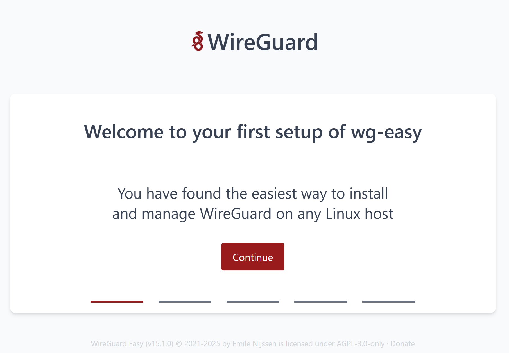
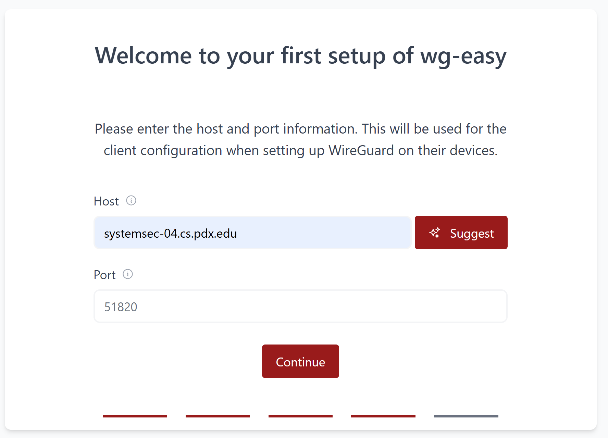
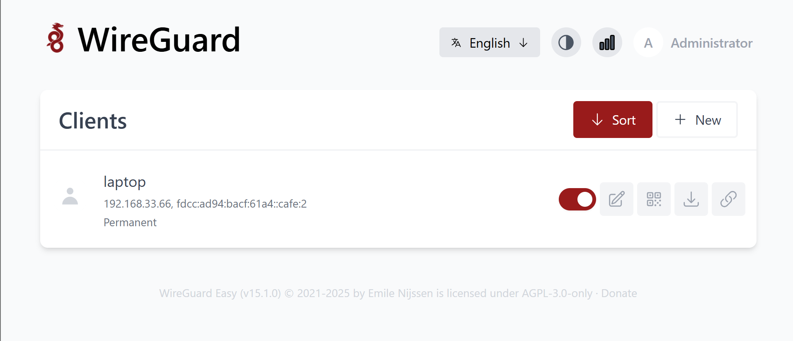
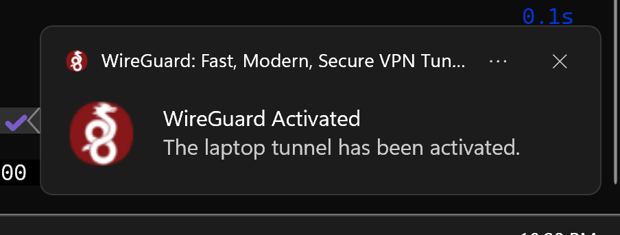
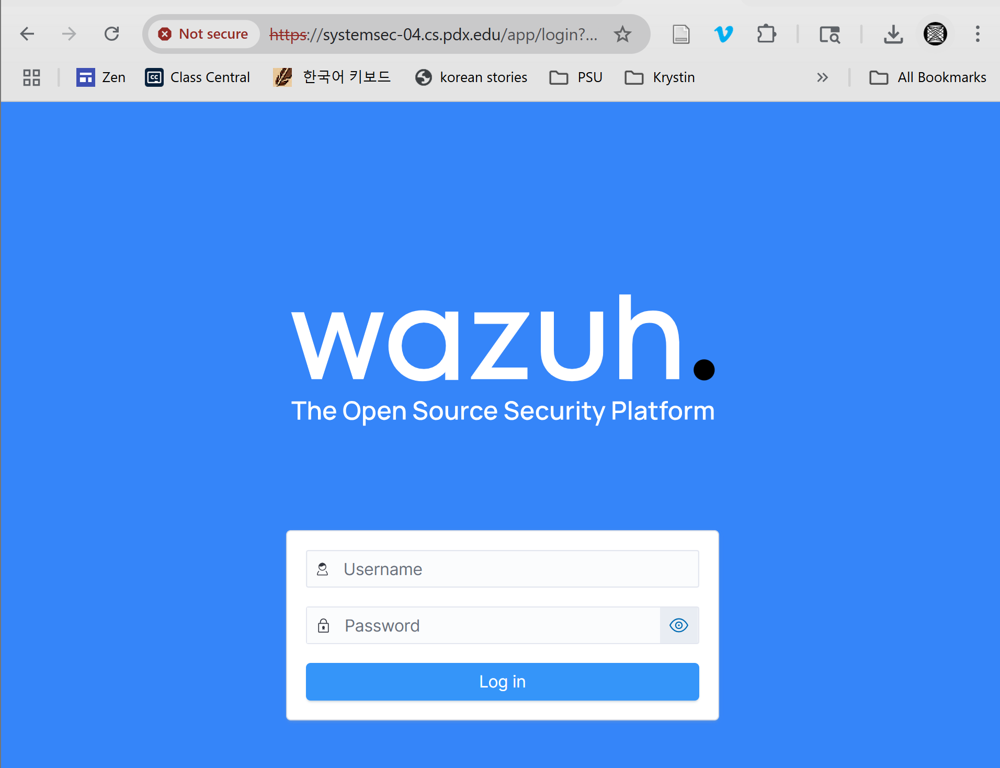
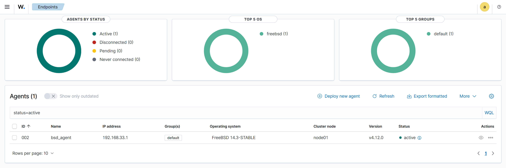
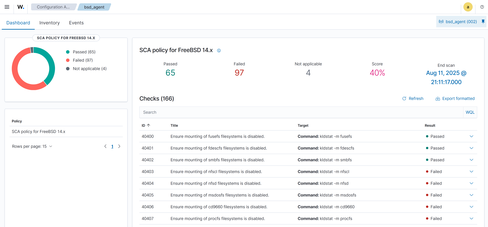
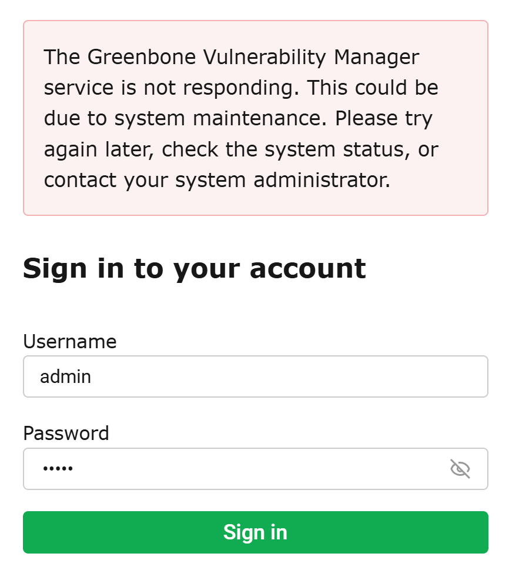

# Pre-template ProxMox Setup
Before I could make the templates, some set up had to be done on Proxmox

## Remove Liscence Warnings

```bash
 $ sudo bash

# remove warning for Proxmox < 8.4.2
 $ curl -LO https://free-pmx.pages.dev/tools/free-pmx-no-subscription_0.2.0.deb
 $ dpkg -i free-pmx-no-subscription_0.2.0.deb

# update Proxmox
 $ apt update && apt upgrade -y

# remove warning for Proxmox >= 8.4.2
 $ curl -LO https://free-pmx.pages.dev/tools/free-pmx-no-subscription_0.3.0~pre1.deb
 $ dpkg -i free-pmx-no-subscription_0.3.0~pre1.deb
```

## Set up SNAT

```
 $ apt install dnsmasq
 $ systemctl disable --now dnsmasq
```

In the UI:
- Naviage to Datacenter > SDN > Zones
    - Create a new Simple zone with and ID of `snat`
        - Tick `automatic DHCP`
- Navigate to Datacenter > SDN > VNET
    - Create a new VNET with ID of `vnet0`
    - Create a new subnet from `vnet0`
        - Set the subnet to a private IP range
        - Set he gateway to the base address of the subnet
        - Tick the`snat` option
        - Go to DHCP Ranges tab and create a new range that is within the subnet
- Click Apply on the SDN panel

## Set up NAT forwarding
This is so that we can ssh to our FreeBSD host through the Proxmox server. 

In `/etc/nftables.conf`

```
#!/usr/sbin/nft -f

flush ruleset

table inet filter {
	chain input {
		type filter hook input priority filter;
	}
	chain forward {
		type filter hook forward priority filter;
	}
	chain output {
		type filter hook output priority filter;
	}
}

table ip nat {
    chain prerouting {
        type nat hook prerouting priority -100; policy accept;
        ip daddr <HOST_IP> tcp dport 22 dnat to 172.18.100.100:22
    }
}
```

Replace `<HOST_IP>` with the IP address given by:

```
 $ ip -o -f inet addr show vmbr0 | awk '{print $4}' | cut -f1 -d/
```

Then apply the new rules:

```bash
 $ nft -f /etc/nftables.conf
 $ nft list table ip nat
```

## Move SSH Port
Finally, since we are redirecting our ssh traffic on port 22 to the FreeBSD
host, we need to move the ssh port on the Proxmox server to 8022 so that it
can still be accessed. 

```
 $ sed -i 's/#Port 22/Port 8022/' /etc/ssh/sshd_config
```

# Setting up templates
I set up two templates: one for FreeBSD and one for Ubuntu. Both were set up 
primarily from the command line, though some tweaks were done using the UI. 

## Cloud Images
```
 $ sudo bash
 $ cd /var/lib/vz/images
 $ curl -LO https://cloud-images.ubuntu.com/releases/noble/release/ubuntu-24.04-server-cloudimg-amd64.imh
 $ curl -LO FreeBSD-14.3-STABLE-amd64-BASIC-CLOUDINIT-20250724-f0a7a1bda375-272016-ufs.qcow2.xz
 $ unxz FreeBSD-14.3-STABLE-amd64-BASIC-CLOUDINIT-20250724-f0a7a1bda375-272016-ufs.qcow2.xz
```

## Setting up the Ubuntu template

```
$  qemu-img resize ubuntu-24.04-server-cloudimg-amd64.img 32G
$  qm create 1000 --name "template-ubuntu" --ostype l26 --memory 4096 --agent 1 --bios seabios --machine q35 --cpu host --socket 1 --cores 4 --vga serial0 --serial0 socket --net0 virtio,bridge=vnet0
$  qm importdisk 1000 ubuntu-24.04-server-cloudimg-amd64.img local-lvm
$  qm set 1000 --scsihw virtio-scsi-pci --virtio0 local-lvm:vm-1000-disk-0,discard=on
$  qm set 1000 --boot order=virtio0
$  qm set 1000 --ide2 local-lvm:cloudinit
$  cat << EOF | tee /var/lib/vz/snippets/vendor.yaml
#cloud-config
runcmd:
   - apt update
   - apt install -y qemu-guest-agent
   - systemctl start qemu-guest-agent
   - reboot
EOF
 $  qm set 1000 --cicustom "vendor=local:snippets/vendor.yaml"
 $  qm set 1000 --ciuser student
 $  qm set 1000 --cipassword $(openssl passwd -6 super_secret_password)
 $  qm set 1000 --ipconfig0 ip=dhcp
 $  qm cloudinit update 1000
 $  qm template 1000
```

At the end of these commands, we have a template ubuntu server with default
creds `student:super_secret_password` that can be cloned. 

## Setting up the FreeBSD template
The process is much the same as above. There are a couple changes:
- use the FreeBSD image in `resize` and `importdisk`
- change the name to `template-freebsd` in `create`
- The ID will be 1001 instead of 1000
- Create a new `freebsd.yaml` to replace `vendor.yaml

After creating the template as above, I also added another NIC using the web 
UI. Go to template-freebsd > Hardware > Add > Network Device and add a E1000
on the internal network. I also changed net0 from virtio to e1000. 

```
 $ cat freebsd.yaml
#cloud-config
runcmd:
    - pkg update
    - pkg install -y qemu-guest-agent
    - sysrc qemu_guest_agent_enable="YES"
    - reboot
```

# Terraform (OpenTofu)
I split my terraform script up into two files: one for the provider and one for
the actual machines. 

## providers.tf
I basically just copied this during class and haven't touched it since. It
seems to work like a charm, so good enough. 

```tf
terraform {
        required_version = ">= 0.15"
        required_providers {
                proxmox = {
                        source = "telmate/proxmox"
                        version = "3.0.2-rc03"
                }
        }
}

provider "proxmox" {
        pm_debug = true
        pm_tls_insecure = true

        pm_api_url = "https://systemsec-04.cs.pdx.edu:8006/api2/json"
}
```

## main.tf
Setting up the terraform script for each VM was a little frustrating.
When cloning a template from the Proxmox UI all of the settings for the VM
(cloudinit users, NICs, drives, etc.) are carried over. The tf `clone` keyword
only clones the disk data, so all of the setup done on the template needs to be
done explicitly within the script. 

Fortunately, we can use the commands from setting up the templates as a guide
for writing the terraform script, and most all of the keywords are the same. 

This is the terraform for the FreeBSD bastion. The Ubuntu VMs are very similar.

It is worth noting that the keyword where it says `bastion` below must be
unique to each VM that gets created.

```tf
resource "proxmox_vm_qemu" "bastion" {
	name	 	= "bsd"
	description	= "FreeBSD Bastion"
	target_node 	= "systemsec-04"
	clone 		= "template-freebsd"
	vmid		= 100
	agent		= 1

	memory 		= 4096
	balloon         = 2024
	scsihw		= "virtio-scsi-pci"

	os_type		= "cloud-init"
	ipconfig0	= "ip=dhcp"
	ciupgrade	= true
	cicustom	= "vendor=local:snippets/freebsd.yaml"
	ciuser		= "sawyeras"
	cipassword	= "SHA512-passwd-hash"

	cpu {
		cores = 4
	}
	
	network {
		id = 0
		model = "e1000"
		bridge = "vnet"
	}

	network {
		id = 1
		model = "e1000"
		bridge = "internal"
	}

	disk {
		slot = "ide2"
		type = "cloudinit"
		storage = "local-lvm"
	}

	disk {
		slot = "virtio0"
		storage = "local-lvm"
		size = "32G"
	}
	
	serial {
		id = 0
		type = "socket"
	}
	
}
```

One of the Ubuntu VMs has up to 8GB of memory, and the other has up to 4GB. 

## Running 
```
 $ tofu init
Initializing the backend...

Initializing provider plugins...
- Finding telmate/proxmox versions matching "3.0.2-rc03"...
- Installing telmate/proxmox v3.0.2-rc03...
- Installed telmate/proxmox v3.0.2-rc03. Signature validation was skipped due to the registry not containing GPG keys for this provider

OpenTofu has created a lock file .terraform.lock.hcl to record the provider
selections it made above. Include this file in your version control repository
so that OpenTofu can guarantee to make the same selections by default when
you run "tofu init" in the future.

OpenTofu has been successfully initialized!

You may now begin working with OpenTofu. Try running "tofu plan" to see
any changes that are required for your infrastructure. All OpenTofu commands
should now work.

 $ export PM_USER=student@pve
 $ export PM_PASS=<password>

 $ tofu plan
```

FreeBSD is not great at running cloud init. In order to get it to run, you have
to log on to the machine, install cloud-init, and add it to `rc.conf`. Then
restart and cloud init will actually run as expected. 

```
 $ pkg install py311-cloud-init 
 $ sysrc cloudinit_enable="YES"
 $ reboot
```
It's also worth noting that the cloud init process changes the name of `em0` to
`eth0`. This can be fixed by removing the line in `rc.conf` that renames the 
interface. 

The Ubuntu VMs run cloud init just fine after being created. 

# Ansible
I installed ansible on the same system that I'm running OpenTofu from. In order
for some of the modules to work, I needed to install ansible from pipx rather 
than apt. 

I only installed the `community.general` collection because it had a lot of the
FreeBSD specific modules, such as sysrc. 

```
 $ ansible-galaxy collection install community.general
```

## Structure
I decided to do a role based structure since it would allow me to easily share
the tasks that are common between the bastion and the Ubunutu VMs. 

This is the structure of my ansible directory:

```
ansible
├── files
│   ├── bsd-pyenv.sh
│   ├── noble0-compose.yaml
│   ├── pf.conf
│   ├── suricata.yaml
│   └── ubuntu-pyenv.sh
├── group_vars
│   ├── all.yaml
│   ├── freebsd.yaml
│   └── noble.yaml
├── roles
│   ├── bsd
│   │   └── tasks
│   │       └── main.yaml
│   ├── dev-env
│   │   └── tasks
│   │       └── main.yaml
│   ├── noble0
│   │   └── tasks
│   │       └── main.yaml
│   ├── noble1
│   │   └── tasks
│   │       └── main.yaml
│   ├── pkgs
│   │   └── tasks
│   │       └── main.yaml
│   ├── services
│   │   └── tasks
│   │       └── main.yaml
│   ├── ubuntu
│   │   └── tasks
│   │       └── main.yaml
│   └── upgrade
│       └── tasks
│           └── main.yaml
├── bastion.yaml
├── hosts
├── servers.yaml
└── services.yaml
```

## Inventory
Since I'm running ansible from my local machine, I have ansible connect to
the VMs through ssh, which is configured in my `hosts` inventory file. 

Because of the way we have port forwarding set up for the machines, 
they all have the same host IP and only differ in their ports. I do have
to have `bsd` and `noble0` with the same port, though, since ansible needs to 
connect to the bastion *before* the ssh port is changed to 8022. This does mean
that the `known_hosts` complains, but removing it is easy enough. 

```ini
[noble]
noble0 ansible_port=22
noble1 ansible_port=22222

[freebsd]
bsd ansible_port=22 ansible_python_interpreter=/usr/local/bin/python3

[all:vars]
ansible_host=systemsec-04.cs.pdx.edu
ansible_user=sawyeras
ansible_ssh_private_key_file=/home/sawyeras/.ssh/windows_key

[noble:vars]
ansible_python_interpreter=/usr/bin/python3
```

## Files Directory
The files directory is for files that are to be copied to the target system.
There were some things that were just easier to plop in than to try to edit
or build on their own. This does come with a bit of a downside for `pf.conf` in
particular because the IP addresses of `$server` and `$server1` need to change
based on what cloudinit assigns them, but given that they don't have IP 
addresses until after the bastion is at least partially set up, I still prefer
to just drop the file in.

## group\_vars
I only have a couple of variables set up. `all.yaml` just contains the 
`packages` variable, which is a list of the packages that both FreeBSD and
Ubuntu use. `freebsd.yaml` and `noble.yaml` are only slightly more interesting. 

Both have a list of packages that are to be installed based on the OS, but they
also have the `pyenv_script` and `zsh_path` variables. These make it so that
certain tasks can be in the common role and still work even though the actual
content is different between the OSes. 

## Pre-ansible Config
The way I currently have things set up, I can run ansible immediately after
terraform finishes creating the VMs. There are a couple reasons for this:

1. cloudinit doesn't work properly for my FreeBSD image

For some reason the cloudinit image that I have doesn't actually have the
cloudinit package. Because of this, I have to login to the VM, install
`py311-cloud-init`, add it to `rc.conf`, and then reboot before cloudinit will
actually run.

2. Ansible needs python3 to run

In order for ansible to connect to the VM and execute commands, the VMs need to
have python already installed on them. The Ubuntu VMs have python. The FreeBSD
machine does not. 

3. I un-rename em0

A part of the cloudinit config renames `em0` to `eth0`. I don't like this,
so I remove that line and reboot. 

All in all, this is the workflow before running ansible:

```
# login as root
 $ pkg install -y py311-cloud-init python3 vim
 $ sysrc cloudinit_enable="YES"
 $ reboot

# login as cloudinit user
 $ sudo vim /etc/rc.conf
 $ sudo reboot
```

## Plays
I originally only had one playbook, called `site.yaml`. I eventually split
that up into `bastion.yaml` and `servers.yaml` because when the play for 
the bastion finishes, the act of loading the firewall rules disrupts ansible's
connectivity, so it doesn't finish gracefully. By splitting them up, I can 
configure the bastion, Ctl-C to stop ansible once the firewall rules are 
enabled, and then configure the Ubuntu machines. 

I have `services.yaml` (for setting up the docker services) separate from 
`servers.yaml` just because it made testing easier. 

```yaml
# --- bastion.yaml --- 
- name: Configure FreeBSD Bastion
  hosts: freebsd
  roles:
    - role: pkgs
    - role: bsd
    - role: dev-env
    - role: services

# --- servers.yaml --- 
- name: Configure Ubuntu Systems
  hosts: noble
  roles:
    - role: upgrade
    - role: pkgs
    - role: ubuntu
    - role: dev-env

# --- services.yaml --- 
- name: Docker -- noble0
  hosts: noble0
  roles:
    - noble0

- name: Docker -- noble1
  hosts: noble1
  roles:
    - noble1
```

## Roles
Originally I only had three roles: common, bsd, and ubuntu. I ended up needing
to split common into pkgs and dev-env because of the order in which things 
needed to be done. I also needed to take some of the ubuntu roles tasks and
move them into the upgrade role because of the order of operations. 

### pkgs 
This role is just to install the packages that are common between the two 
operating systems and to create the `clones/` and `bin/` directories that
are used later. 

The reason that I can use a single module to install
packages on both FreeBSD and Ubuntu is because the `package` module does its 
best to detect the operating system and choose the correct package manager. On
Ubuntu it redirects to the built-in `apt` module, and on FreeBSD it redirects 
to `community.general.pkgng`. 

```yaml
- name: Install Common Packages
  become: true
  package:
    name: "{{ packages }}"
    state: present

- name: Install OS Packages
  become: true
  package:
    name: "{{ os_pkgs }}"
    state: present

- name: Create Directories
  file:
    path: "{{ item }}"
    state: directory
    mode: '0775'
  loop:
    - "{{ ansible_env.HOME }}/bin"
    - "{{ ansible_env.HOME }}/clones"
```

### bsd
This role configures the networking in `rc.conf`, dnsmasq, and Suricata. The 
way that I add SMBGhost Suricata rules to `suricata.rules` is with the 
`lineinfile` module, and I don't know if that's the best way to do it, but it
seems to work. 

Originally as a part of editing `rc.conf` I tried to remove the line that 
cloudinit adds that changed the name of `em0`. I was able to remove the line,
but I wasn't able to reboot reliably, which is why it's something I do manually
before running. 

For some reason, installing the FreeBSD specific packages doesn't work on the
first try. `lolcat` always throws an error and ansible stops executing. But it
always works on the second run (and by works I mean doesn't throw an error. 
`lolcat` still doesn't successfully install). 

### dev-env
This roles is all about setting up the user environment. It clones a bunch of 
git repos, sets up the python environment, configures git, and changes the 
user's default shell to zsh.

This is the role where things start to get a little hacky. While it's easy to
change a `git clone` command into something for the git module to use, there
are some things, like curl-ing a script and piping it straight into bash, 
that only really happen as a bash command. There was already so much that I
was trying to change, I decided to let the plays stay a little rough around the
edges. 

```yaml
- name: Setup .zshrc
  shell: curl http://web.cecs.pdx.edu/~dmcgrath/setup_freebsd.tar.bz2 | tar xjvf - -C ~/
```

In doing this, though, I learned a very annoying lesson about the difference
between the `command` and `shell` modules. The shell module does what you 
expect it would. It runs an arbitrary shell command exactly as you typed it. 
The command module is a demon that laughs in your face as you tear your hair
out trying to figure out what could possibly be wrong.

The part that I am absolutely the most proud of is how I set up the pyenv 
environment. I originally tried to find a module, but I didn't see one quickly. 
Then I tried to run a series of shell commands, but they didn't take. I thought
for a long time that I would just have to come in at the end and install it 
myself. But then I decided to try if a shell script would execute properly, and
it worked. 

What I have ansible do is drop in a script from the files directory, run it 
(conditionally -- it only runs if the path that pyenv creates isn't valid), and
then remove the script from the system. It's possible that there's a better way
to do this, but I spent many hours banging my head against a wall and am very
pleased with how this turned out. 

```yaml

- name: Create pyenv script
  copy:
    src: "{{ pyenv_script }}"
    dest: "{{ ansible_env.HOME }}/setup.sh"
    mode: 0775

- name: Run pyenv script
  shell:
    cmd: ./setup.sh
    creates: /home/sawyeras/.pyenv/shims/python

- name: Remove pyenv script
  file:
    path: "{{ ansible_env.HOME }}/setup.sh"
    state: absent

```

### services
This role activates the services that are set up eariler. It starts dnsmasq,
moves the ssh port to 8022 and restarts the service, and finally enables
the firewall rules. As mentioned above, this run doesn't gracefully finish 
execution. But it all works. 

### upgrade
This role is to do a full upgrade on the Ubuntu VMs. The full upgrade is needed
to install many of the packages that are needed. In an ideal world this would
be a part of the ubuntu role, but because of the timing it got pulled out
into it's own role. 

```yaml
- name: Full Upgrade
  become: true
  apt:
    update_cache: yes
    upgrade: "full"
```

### ubuntu
This role mostly just handles installing some of the environment tools by 
cloning git repos because they can't be installed with `apt` (whereas they 
could be installed with `pkg`). 

The tasks below are of the general form found in this file of "clone then
build". 

```yaml
- name: Clone fastfetch
  git:
    repo: https://github.com/fastfetch-cli/fastfetch.git
    dest: "{{ ansible_env.HOME }}/clones/fastfetch"

- name: Make fastfetch build dir
  shell:
    chdir: "{{ ansible_env.HOME }}/clones/fastfetch"
    cmd: mkdir -p build

- name: Build fastfetch
  shell:
    chdir: "{{ ansible_env.HOME }}/clones/fastfetch/build"
    cmd: "{{ item }}"
  loop:
    - cmake ..
    - cmake --build . --target fastfetch --target flashfetch
    - sudo make install
```

I also used the `shell` module instead of the `git` module for cloning 
nerd-fonts because I didn't want to deal with the shallow checkout stuff, which
seemed like it would need multiple tasks to handle rather than a single git 
command. 

### noble[01]
I originally had plans to use a template that would allow me to have each
service as its own role, and then another role would compile them into a single
arbitrary `docker-compose.yaml`. It was very close to working, but I couldn't 
quite get the template to format it correctly.

Instead, I have premade docker compose files that I copy onto the target system
and then start and maybe do some system configuration if needed. The noble 
roles just determine which file gets dropped in. 

# Services
Now that the VMs are created and running, it's time to set up some more
services. 

## Wireguard
To start, I grabbed the docker compose file from wg-easy's github. 

```
 $ curl -o docker-compose.yaml https://raw.githubusercontent.com/wg-easy/wg-easy/master/docker-compose.yml
```

I changed it so that `INSECURE=true` so that I could login without https. 

As soon as the container is up, I can connect to the dashboard. This leads to 
a form for setting up the admin account and the domain that clients should
connect to.





After going through the setup, I can log in with the credentials that I just
created. Then I can add clients and do a little more config with the admin 
console. In the admin console, I went to Interface > Change CIDR and changed
the CIDR address to 192.168.33.69/26 which fits within the subnet given to 
the ubuntu VMs. 

Then I can create a client, download the config file, and upload it to the 
wireguard client on my local machine. 







I can see that I'm connected to the wireguard client, but I don't actually have
any internet access. I'm not sure how to fix this. I did lots of googling, but 
didn't come across anything useful. It was mentioned in class that there needs
to be some kind of bridge between the wireguard network and the VM subnet, but
I don't know how to set this up correctly. 

## Wazuh
The first thing that the docker install instructions from Wazuh tell you to do
it increase the `max_map_count` on the host because Wazuh needs there to be a 
minimum of 262,144. I didn't have to do this because the default on the VM was
already above the minimum. 

```
 $ sysctl vm.max_map_count
vm.max_map_count = 1048576
```

I cloned the Wazuh repo, which has premade docker compose files.

```
$ git clone https://github.com/wazuh/wazuh-docker.git -b v4.12.0
```

I decided to use the single node deployment because I don't need high 
availability and I don't think my VM has the resources to handle multiple
nodes. 

Without changing anything I am able to access the dashboard and login.



Then, I installed a wazuh agent on the FreeBSD bastion. 

```
 $ sudo pkg install wazuh-agent

...

Wazuh Agent was installed

1) Copy /etc/locatime to /var/ossec/etc directory

   # cp /etc/localtime /var/ossec/etc

2) You must edit /var/ossec/etc/ossec.conf.sample for your setup and rename/copy
   it to ossec.conf

   Take a look wazuh configuration at the following url:

   https://documentation.wazuh.com/current/user-manual/index.html

3) Move /var/ossec/etc/client.keys.sample to /var/ossec/etc/client.keys. This
   file is used to store agent credentials

   # mv /var/ossec/etc/client.keys.sample /var/ossec/etc/client.keys

4) You can find additional useful files installed at

  # /var/ossec/packages_files/agent_installation_scripts

5) FreeBSD SCA files are installed by default to the following directory:

   # /var/ossec/packages_files/agent_installation_scripts/sca/freebsd

   For more information about FreeBSD SCA updates take a look at:

   https://github.com/alonsobsd/wazuh-freebsd

6) Add Wazuh agent to /etc/rc.conf

  # sysrc wazuh_agent_enable="YES"

  or

  # service wazuh-agent enable

7) Start Wazuh agent

  # service wazuh-agent start

8) Enjoy it ;)
```

I edited `/var/ossec/etc/ossec.conf` to define the IP address of the wazuh 
manager and change the protocol from UDP to TCP. I added the agent to `rc.conf`
and started it. 

```
  <client>
    <server>
      <address>192.168.33.105</address>
      <port>1514</port>
      <protocol>tcp</protocol>
    </server>
    <config-profile>freebsd, freebsd14</config-profile>
    <crypto_method>aes</crypto_method>
  </client>
```

I spent many, many hours trying to figure out how to connect the agent to the
manager. I tried generating SSL certificates and keys using the rootCA.pem file
given by wazuh. I tried editing `ossec.conf` so that the agent would try to
automatically enroll when it first connected to the manager. I tried to 
generate a key on the manager as shown below and then add it to
`/var/ossec/etc/client.keys` on FreeBSD. I even tried to change authentication
on the manager to password based to see if I could get that working better. 
Nothing was working and I was ready to call it quits. Shoutout to Harrison for 
figuring out how to actually apply the key and sharing. 

```
 noble$ docker exec -it single-node-wazuh.manager-1 /var/ossec/bin/manage_agents

****************************************
* Wazuh v4.12.0 Agent manager.         *
* The following options are available: *
****************************************
   (A)dd an agent (A).
   (E)xtract key for an agent (E).
   (L)ist already added agents (L).
   (R)emove an agent (R).
   (Q)uit.
Choose your action: A,E,L,R or Q: A

- Adding a new agent (use '\q' to return to the main menu).
  Please provide the following:
   * A name for the new agent: bsd_agent
   * The IP Address of the new agent: 192.168.33.1
Confirm adding it?(y/n): y
Agent added with ID 002.


****************************************
* Wazuh v4.12.0 Agent manager.         *
* The following options are available: *
****************************************
   (A)dd an agent (A).
   (E)xtract key for an agent (E).
   (L)ist already added agents (L).
   (R)emove an agent (R).
   (Q)uit.
Choose your action: A,E,L,R or Q: E

Available agents:
   ID: 002, Name: bsd_agent, IP: 192.168.33.1
Provide the ID of the agent to extract the key (or '\q' to quit): 002

Agent key information for '002' is:
<key>

 bsd$ sudo service wazuh-agent start
Starting Wazuh Agent: 2025/08/12 03:29:44 wazuh-syscheckd: WARNING: The check_unixaudit option is deprecated in favor of the SCA module.
success

 bsd$ sudo /var/ossec/bin/manage_agents -i "<key>"

Agent information:
   ID:002
   Name:bsd_agent
   IP Address:192.168.33.1

Confirm adding it?(y/n): y
Added.

 bsd$ sudo service wazuh-agent restart
Stopping Wazuh Agent: success

Starting Wazuh Agent: 2025/08/12 03:31:26 wazuh-syscheckd: WARNING: The check_unixaudit option is deprecated in favor of the SCA module.
succes
```

After this I was able to see the agent in the dashboard, but there weren't any
scans running. 



I copied a file from 
`/var/ossec/packages_files/agent_installation_scripts/sca/freebsd` to 
`/var/ossec/ruleset/sca` and added the below to `ossec.conf`. 


```
  <sca>
    <enabled>yes</enabled>
    <scan_on_start>yes</scan_on_start>
  </sca>
```

When I restarted the agent, I could see the results of the scan in the 
dashboard.



## Semgrep
I chose this SAST tool because it's fully open source and the setup was very
straightforward. I just installed it using `pip`.

I tried running it against a few things, including two of the larger projects
I've worked on. It didn't find any issues. I'm assuming this is because over
half of the rules are unavailable in the community edition.

```
 $ pip install semgrep
 $ semgrep --config "p/default"

┌──── ○○○ ────┐
│ Semgrep CLI │
└─────────────┘

Scanning 47 files (only git-tracked) with 1062 Code rules:

  CODE RULES

  Language      Rules   Files          Origin      Rules
 ─────────────────────────────        ───────────────────
  <multilang>      48      47          Community    1062
  json              4       7


  SUPPLY CHAIN RULES

  💎 Sign in with `semgrep login` and run
     `semgrep ci` to find dependency vulnerabilities and
     advanced cross-file findings.


  PROGRESS

  ━━━━━━━━━━━━━━━━━━━━━━━━━━━━━━━━━━━━━━━━ 100% 0:00:00                                          


┌──────────────┐
│ Scan Summary │
└──────────────┘
✅ Scan completed successfully.
 • Findings: 0 (0 blocking)
 • Rules run: 52
 • Targets scanned: 47
 • Parsed lines: ~100.0%
 • Scan skipped:
   ◦ Files larger than  files 1.0 MB: 1
 • Scan was limited to files tracked by git
 • For a detailed list of skipped files and lines, run semgrep with the --verbose flag
Ran 52 rules on 47 files: 0 findings.
💎 Missed out on 1390 pro rules since you aren't logged in!
⚡ Supercharge Semgrep OSS when you create a free account at https://sg.run/rules.
(need more rules? `semgrep login` for additional free Semgrep Registry rules)


✨ If Semgrep missed a finding, please send us feedback to let us know!
   See https://semgrep.dev/docs/reporting-false-negatives/

```

## GVM
I started by following the directions for the fully containerized setup. 

All of the dependencies were already installed so I ignored that step. 

When I tried to set it up exactly how it says to in the documentation 
(uninstalling docker.io package, etc) when I try to connect I get this error:



```
 $ docker logs greenbone-community-edition-gsa-1
starting gsad
gsad main:MESSAGE:2025-08-12 18h48.33 utc:12: Starting GSAD version 24.4.0
gsad gmp:WARNING:2025-08-12 18h49.23 utc:12: Failed to connect to server at /run/gvmd/gvmd.sock: No such file or directory
gsad gmp:WARNING:2025-08-12 18h49.23 utc:12: Authentication failure for 'admin' from 10.200.200.76. Status was 1.
gsad gmp:WARNING:2025-08-12 18h49.34 utc:12: Failed to connect to server at /run/gvmd/gvmd.sock: No such file or directory
gsad gmp:WARNING:2025-08-12 18h49.34 utc:12: Authentication failure for 'admin' from 10.200.200.76. Status was 1.
gsad gmp:WARNING:2025-08-12 18h50.50 utc:12: Failed to connect to server at /run/gvmd/gvmd.sock: No such file or directory
gsad gmp:WARNING:2025-08-12 18h50.50 utc:12: Authentication failure for 'admin' from 10.200.200.76. Status was 1.
```

When I just grab the docker compose file and use the normally installed 
docker.io and docker-compose-v2 packages, I'm able to log in just fine.


Can't load any scan configs

```
❯ docker logs greenbone-community-edition-ospd-openvas-1
OSPD[6] 2025-08-11 16:19:11,525: INFO: (ospd.main) Starting OSPd OpenVAS version 22.9.0.
OSPD[6] 2025-08-11 16:19:21,612: INFO: (ospd_openvas.daemon) Loading VTs. Scans will be [requested|queued] until VTs are loaded. This may take a few minutes, please wait...
OSPD[6] 2025-08-11 16:21:30,129: INFO: (ospd_openvas.daemon) Finished loading VTs. The VT cache has been updated from version 0 to 202508110659.
OSPD[6] 2025-08-11 16:31:24,211: INFO: (ospd_openvas.daemon) Loading VTs. Scans will be [requested|queued] until VTs are loaded. This may take a few minutes, please wait...
OSPD[6] 2025-08-11 16:31:45,600: ERROR: (ospd_openvas.openvas) OpenVAS Scanner failed to load VTs. Command '['openvas', '--update-vt-info']' returned non-zero exit status 1.
OSPD[6] 2025-08-11 16:31:45,600: ERROR: (ospd_openvas.daemon) Updating VTs failed.
```

But able to see the console and add some stuff and things
